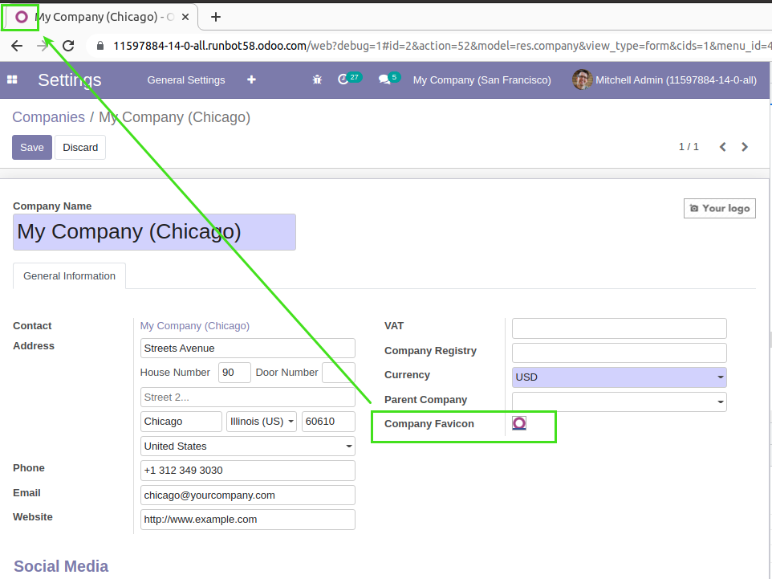
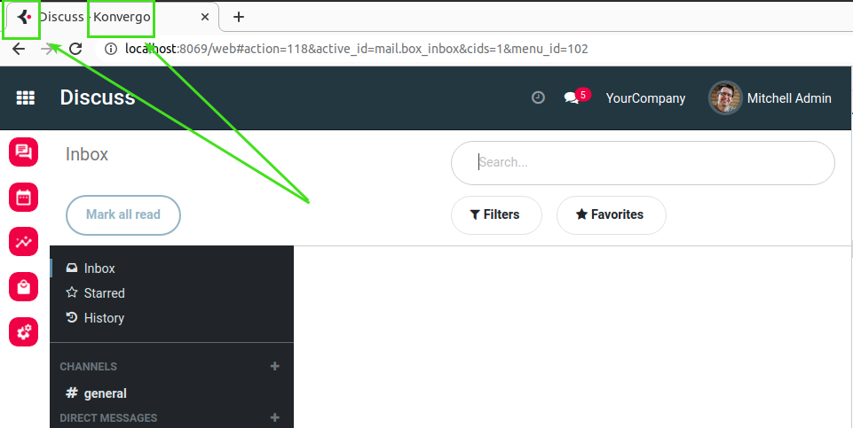
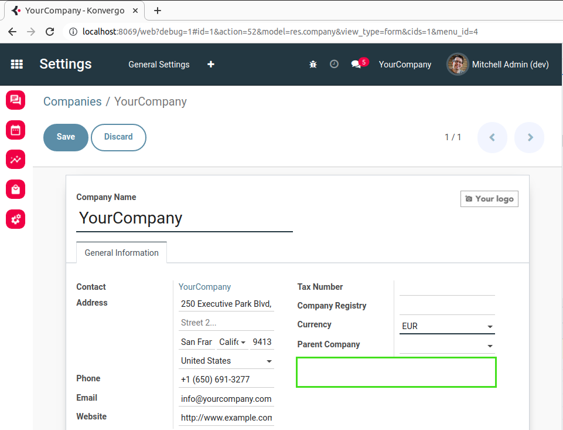

Konvergo Favicon and Title
==========================
This module setups favicon and title for Konvergo instances.

Context
-------
In vanilla Odoo, as of version ``14.0``, the favicon is set for each company.

By default, the ``Odoo`` logo is used as favicon.

Overview
--------
After installing the module, the favicon displayed on the backend is always the ``Konvergo`` logo
and the label ``Odoo`` is replaced with ``Konvergo``.

Behind the scene, the logo is automatically stored as favicon on all companies.

The field to change the favicon is removed from the form view of the company.

Contributors
------------
* Numigi (tm) and all its contributors (https://bit.ly/numigiens)

More information
----------------
* Meet us at https://bit.ly/numigi-com
