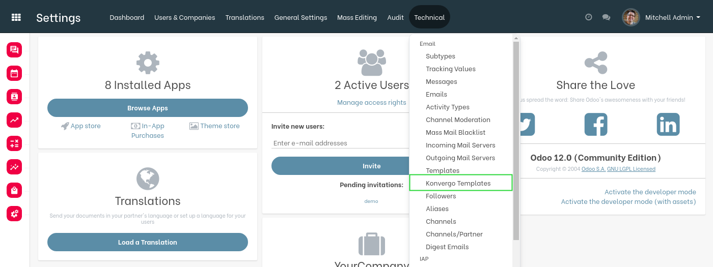
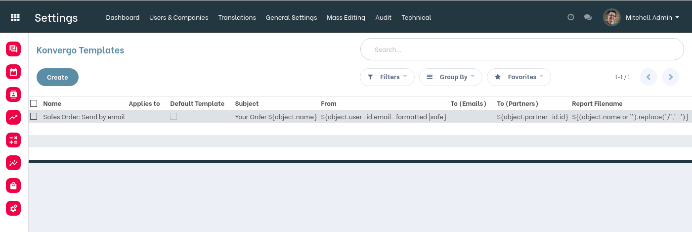
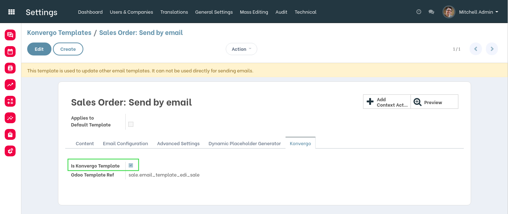
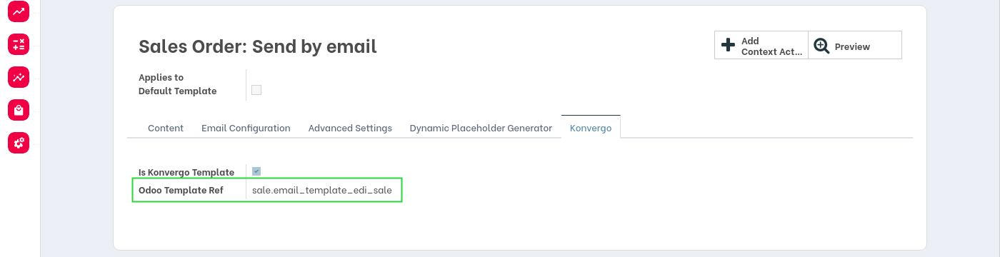
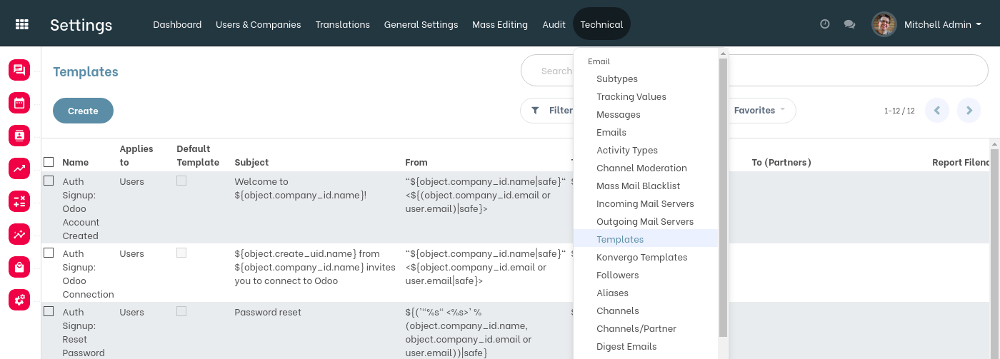
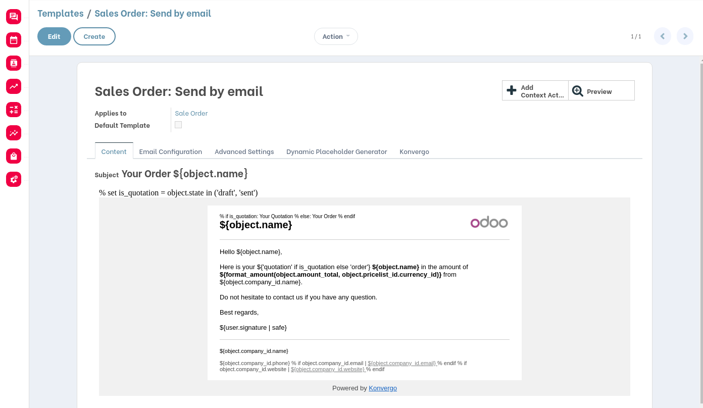
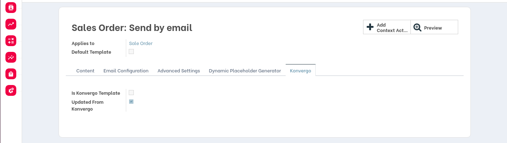
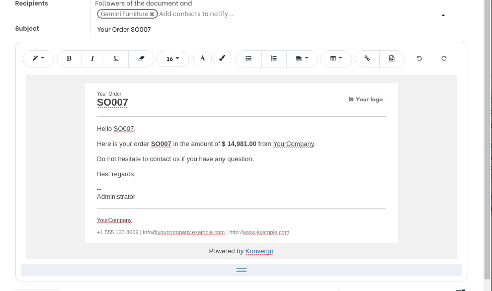

Konvergo Mail Templates
=======================
This module customizes the default Odoo mail templates for Konvergo.

.. contents:: Table of Contents

Context
-------
Odoo comes with predefined email templates.

These email templates are loaded as records with the option noupdate="1".
Therefore, they can not be easily updated by modules.

Moreover, customizing multiple mail templates normally implies multiple dependencies
(because the templates to overwrite reside in different apps).

This module adds a clean mecanism for customizing email templates without depending on each application.

Overview
--------
The module adds a new menu entry ``Konvergo Templates``.

When clicking on this menu entry, konvergo email templates are displayed.

A ``Konvergo`` email template is a email template with the field ``is_konvergo_template`` checked.

Konvergo templates are not meant to be used for sending emails.

However, each konvergo templates automatically updates its related Odoo template.

Odoo Templates
--------------
By default, konvergo templates are hidden from the list views of email templates.

I select the Odoo template related to my konvergo template.

I notice that the field values are identical to the konvergo template.

Konvergo Tab
------------
Inside the form view of email templates, a new tab ``Konvergo`` is added.

This tab is only visible to members of the group ``Administration / Settings``.

Updated From Konvergo
~~~~~~~~~~~~~~~~~~~~~
The field ``Updated From Konvergo`` indicates whether the template was overwritten by a konvergo template.

If checked, the template will not be overwritten by the konvergo template.

This allows the client to further customize his email templates.

Templates
---------

Sale Order
~~~~~~~~~~

Contributors
------------
* Numigi (tm) and all its contributors (https://bit.ly/numigiens)
